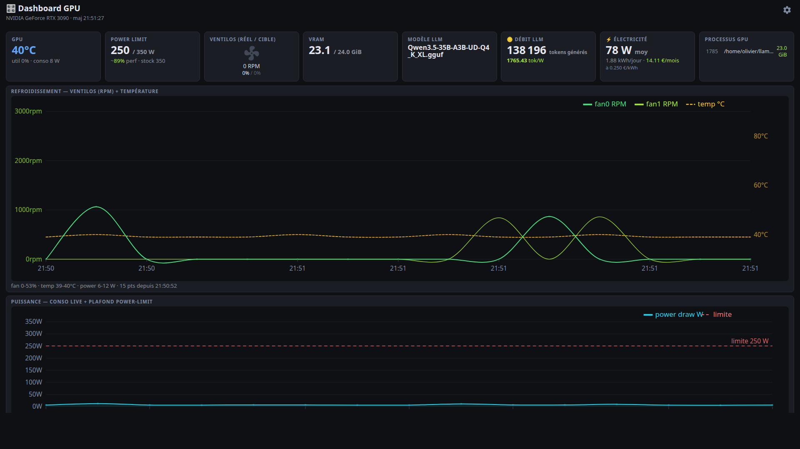
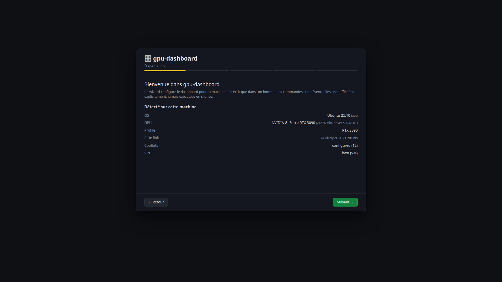
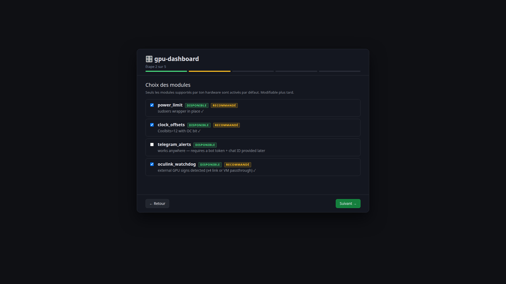
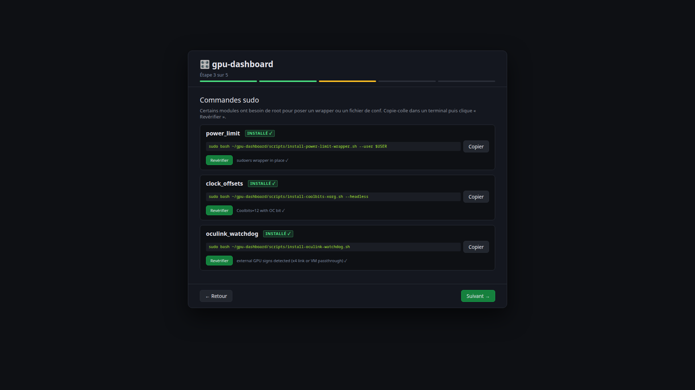
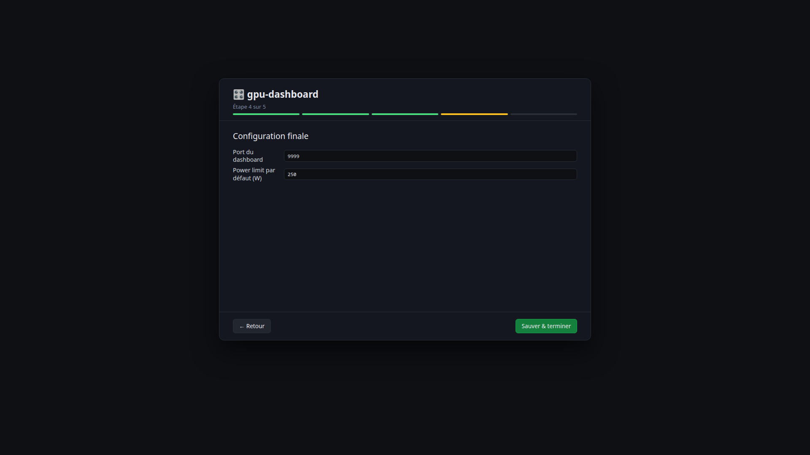

# gpu-dashboard

> Lightweight NVIDIA GPU monitoring + tuning dashboard for Linux.
> Built for LLM rigs and eGPU/OcuLink setups. Pure Python stdlib + jsonschema.

🇬🇧 English · [🇫🇷 Français](README.fr.md)

[](https://github.com/Shad107/gpu-dashboard/actions/workflows/ci.yml)
[](LICENSE)




### 5-step web wizard on first launch

<table>
<tr>
<td width="50%"></td>
<td width="50%"></td>
</tr>
<tr>
<td width="50%"></td>
<td width="50%"></td>
</tr>
</table>

## What it does

A small HTTP dashboard you point your browser at (`http://localhost:9999`) that shows:

- **Live GPU state** — temperature, fan RPMs, power draw, clocks, VRAM
- **OcuLink/eGPU watchdog** — uptime tracking, Telegram alerts on link drops
- **Power-limit slider** — adjust GPU wattage cap from the UI (with live perf-% estimate per card)
- **Clock-offset sliders** — undervolt or overclock with safe/moderate/aggressive/danger zones
- **GPU profiles per card** — RTX 3090, 3090 Ti, 4090, 5090 bundled, generic fallback;
  community contributes more via PR

Built specifically for headless/SSH'd Linux boxes running LLMs locally (Qwen, Llama, etc.)
on consumer NVIDIA cards — including marginal setups (eGPU over OcuLink/Thunderbolt).

## Why?

Existing tools fall short:
- `nvtop` is great in a TTY but offers no control, no alerting
- GreenWithEnvy needs a GTK desktop session running on the NVIDIA itself
- `nvidia-smi -pl` lives in a terminal, no history, no slider
- Nothing tracks OcuLink eGPU link drops with phone alerts

This tries to be the missing middle: **web UI, controllable, scriptable, alertable**.

## Hardware support

| GPU | Profile | Status |
|---|---|---|
| RTX 3090 | `rtx-3090.json` | ✅ Calibrated on real hardware |
| RTX 3090 Ti | `rtx-3090-ti.json` | ⚠ Estimated perf curve |
| RTX 4090 | `rtx-4090.json` | ⚠ Estimated perf curve |
| RTX 5090 | `rtx-5090.json` | ⚠ Based on published benchmarks |
| Others (NVIDIA) | `_generic.json` (fallback) | Conservative limits |

> Got a card not in the list? See [`profiles/SCHEMA.md`](profiles/SCHEMA.md) and open a PR.

## Install — 30 seconds, web wizard

Requires Linux + NVIDIA driver + Python 3.9+.
Tested on Ubuntu 24.04 / 25.10, Fedora 40, Arch.

### Option A — one-liner bootstrap + web wizard (recommended)

```bash
curl -fsSL https://raw.githubusercontent.com/Shad107/gpu-dashboard/main/scripts/get.sh | bash
```

The script does **only** these things (no sudo, no auto-install of system packages):

1. Clones the repo to `~/gpu-dashboard`
2. `pip install --user jsonschema` (the only Python dep)
3. Starts the dashboard in the background on port 9999
4. Prints the URL to open in your browser

Open the URL, a **5-step wizard** walks you through:
- Detected hardware (GPU, OS, profile match)
- Which optional modules to enable
- For each module needing root, the **exact sudo command to copy-paste in a terminal** (the wizard re-checks it after you run it)
- Final config (port, default power-limit)
- Done — restart the dashboard to apply

> **Want to audit the script first?** It's 116 lines, viewable at [`scripts/get.sh`](scripts/get.sh).
> Don't trust `curl | bash`? Use Option B below.

### Option B — manual clone (full audit)

```bash
git clone https://github.com/Shad107/gpu-dashboard.git
cd gpu-dashboard
python3 -m pip install --user jsonschema
PYTHONPATH=src python3 -m gpu_dashboard
```

Open `http://localhost:9999` — the same web wizard runs.

### Option C — CLI install (headless / scripted)

For headless servers or automation, the legacy interactive CLI is still available:

```bash
git clone https://github.com/Shad107/gpu-dashboard.git
cd gpu-dashboard
./install.sh --detect-only    # show what would happen (no writes)
./install.sh                   # interactive prompts
PYTHONPATH=src python3 -m gpu_dashboard
```

### Sudo commands the wizard suggests

The wizard never runs sudo silently. For each module needing root, you'll see
**one** bash command pointing to an audit-friendly script in the repo:

| Module | Command suggested by wizard |
|---|---|
| `power_limit` | `sudo bash scripts/install-power-limit-wrapper.sh --user $USER` |
| `clock_offsets` | `sudo bash scripts/install-coolbits-xorg.sh` (`--headless` for VM/eGPU) |
| `oculink_watchdog` | `sudo bash scripts/install-oculink-watchdog.sh` |

Each script supports `--check` (verify if already installed) and `--print`
(show what it would write without writing) so you can audit before running.

## Architecture

```
gpu-dashboard/
├── src/gpu_dashboard/          # Python source
│   ├── perf.py                  # perf-curve interpolation
│   ├── config.py                # layered .env config loader
│   ├── profile.py               # GPU profile load + match + JSON Schema validation
│   ├── detect.py                # env probing (OS, NVIDIA, Coolbits, OcuLink…)
│   ├── install.py               # interactive installer logic
│   └── modules/
│       ├── power_limit.py       # sudoers wrapper for nvidia-smi -pl
│       ├── clock_offsets.py     # nvidia-settings, no sudo via Coolbits
│       └── telegram_alerts.py   # urllib stdlib, no `requests` dep
├── profiles/                    # JSON profiles + JSON Schema
└── tests/                       # pytest, 178 tests, no external services
```

## Optional modules

Each feature is opt-in — `install.sh` only proposes what your env supports.

| Module | Requirement | What it adds |
|---|---|---|
| **power_limit** | sudoers wrapper installed | UI slider 100-350W (or per-card max), live perf-% estimate |
| **clock_offsets** | Coolbits ≥ 8 in xorg.conf | Sliders for GPU/mem clock offsets with risk zones |
| **telegram_alerts** | bot token + chat ID | Push notifications on events |
| **oculink_watchdog** *(v0.2)* | eGPU detected (PCIe x4 link) | Tracks link uptime, alerts on drops |
| **fan_curve** *(v0.2)* | Headless Xorg :0 on NVIDIA | Custom fan curve replacing the stock NVIDIA one |

## Contributing

Profiles for new cards are **the highest-value contribution**. See
[`profiles/SCHEMA.md`](profiles/SCHEMA.md). Code contributions welcome too — see
[`CONTRIBUTING.md`](CONTRIBUTING.md).

## License

MIT. See [`LICENSE`](LICENSE).

## Roadmap

See [`docs/PLAN.md`](docs/PLAN.md) for the detailed plan, sequencing, and milestones.
