# gpu-dashboard

> Lightweight NVIDIA GPU monitoring + tuning dashboard for Linux.
> Built for LLM rigs and eGPU/OcuLink setups. Pure Python stdlib + jsonschema.

🇬🇧 English · [🇫🇷 Français](README.fr.md)

[](https://github.com/Shad107/gpu-dashboard/actions/workflows/ci.yml)
[](LICENSE)


> Showing 8 live cards : GPU temp · power-limit + perf% · fan RPM/target · VRAM ·
> **LLM model** (real-time from llama-server) · **🪙 Tokens generated + tok/W
> efficiency** (unique to gpu-dashboard) · **⚡ Electricity €/month** · Compute
> processes. Below : Cooling chart (fan0/fan1 RPM + temp dashed) and Power chart
> (live draw + power-limit cap).

### Mobile responsive
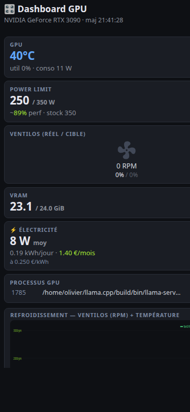

### 🖥️🖥️ Multi-GPU support

On rigs with more than one NVIDIA GPU detected, the header gains a picker
dropdown listing each card. Selecting a different GPU instantly switches
**all** displayed data — Cards, History chart, Stats sparklines, electricity,
LLM throughput — to that GPU's samples.

- The sampler polls all GPUs every tick ; each sample is stored with
  its `gpu_index` (DB schema v4)
- Picker selection persists in `localStorage`, bookmarkable via `?gpu=N`
- Per-GPU API : every data endpoint accepts `?gpu_index=N`
- Single-GPU rigs : zero change — the picker is hidden, everything works
  as before

### 🎨 Themes — dark (default) + light

Toggle via **Settings → Préférences → Layout → 🎨 Thème**, or use the
URL override `?theme=light` / `?theme=dark` (bookmarkable). Choice
saved in localStorage.

<table>
<tr>
<td width="50%">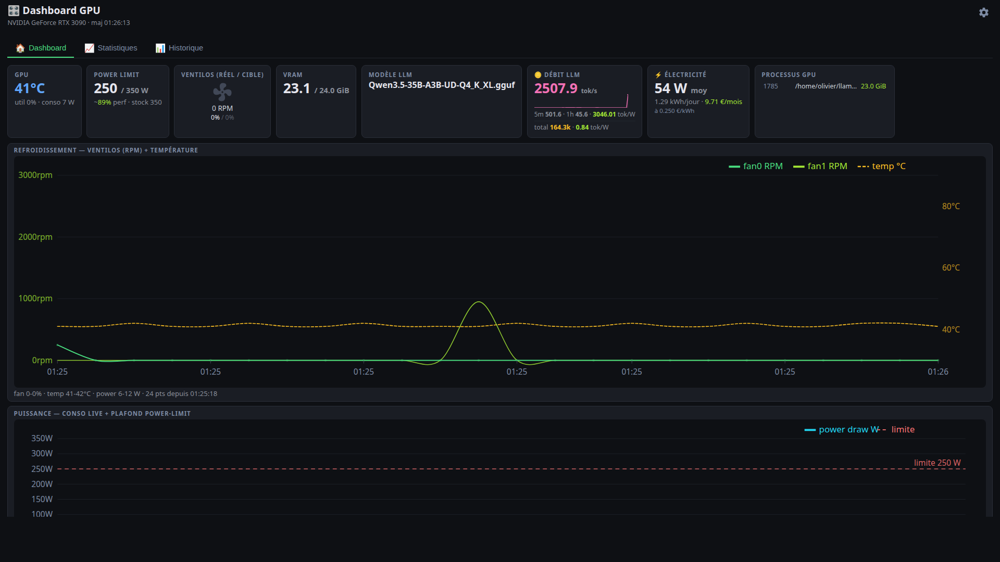<br/><sub><b>🌙 Dark</b> — default, easy on the eyes for late-night sessions</sub></td>
<td width="50%">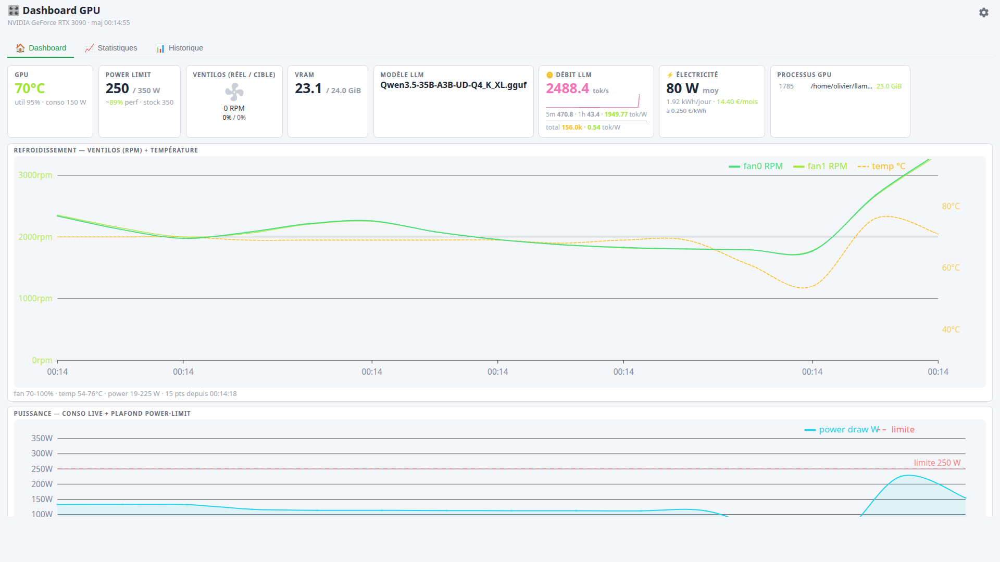<br/><sub><b>☀️ Light</b> — bright background for daytime use</sub></td>
</tr>
</table>

### 📈 Stats page — perf overview at a glance

A single top-level page (`#stats`) showing year-to-date energy/cost,
LLM tokens, thermal & power sparklines, profile time breakdown,
heatmap, fan distribution, and the recent alerts list.

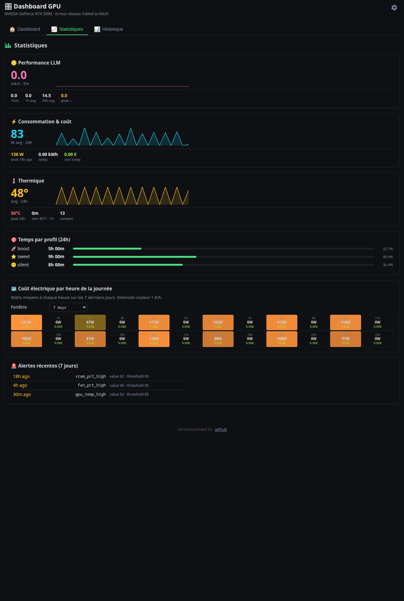

### 🌀 Fan curve editor

Visual editor for the fan curve daemon — drag, click, keyboard. Lives in
**Settings → Tuning → Courbe ventilo** (modal tab, 10 tabs total).

- **Drag** any control point to reshape (temp stays clamped between neighbors)
- **Double-click** an empty area of the SVG to insert a new control point
- **Right-click** a point to remove (min 2 points enforced)
- **Click + arrow keys** for fine-tuning : ±1°C / ±1% per arrow, Shift = ±5
- **Tab** cycles through points · **Delete** removes the selected one · **ESC** deselects
- **3 one-click presets** : 🤫 Silent · ⚖️ Balanced · 🔥 Aggressive
- **💾 Save** persists to `~/.config/gpu-dashboard/fan_curve.json` (overrides profile)
- **Daemon picks up the new curve on next poll** — no restart needed
- **±2°C hysteresis** built-in to prevent fan oscillation near a control point

Visual cues : live GPU temp shown as vertical cyan line on the curve, current
fan target shown as horizontal dashed line, selected point shows coordinate
label (e.g. "78°C · 65%") in amber.

### Settings — 10 tabs, all 1 click away

Bookmarkable via `?modal=<tab>` (e.g. `http://localhost:9999/?modal=fancurve`).
History and Stats are now top-level views (not modal tabs) — see the section above.

<table>
<tr>
<td width="50%">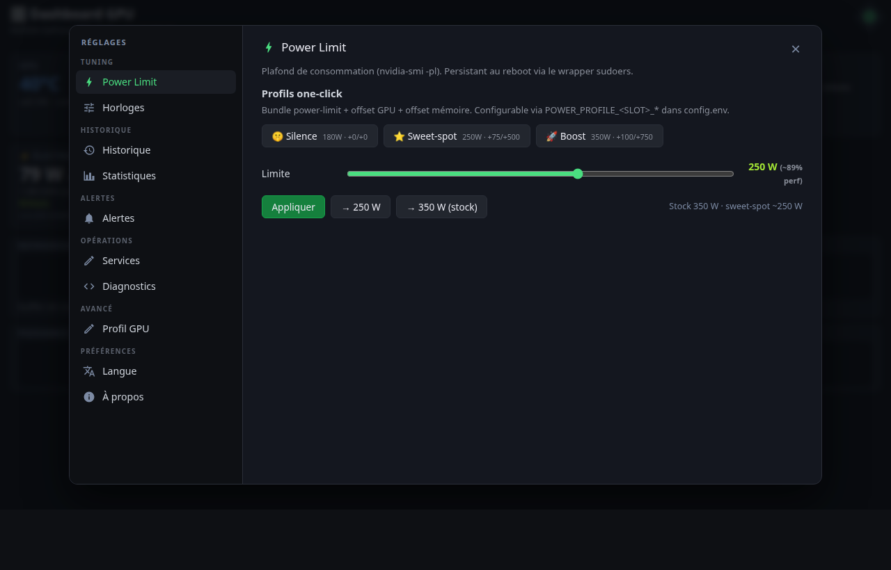<br/><sub><b>Power Limit</b> — slider with live perf% + 3 named presets bundling power-limit + offsets</sub></td>
<td width="50%">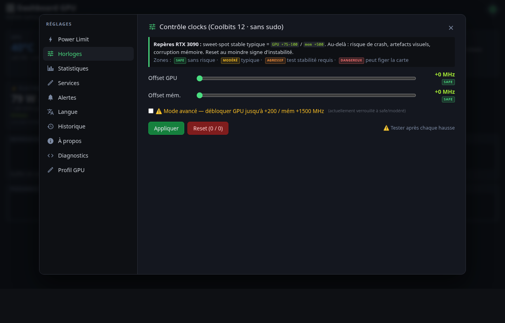<br/><sub><b>Clocks</b> — GPU/mem offsets with risk zones + Advanced unlock</sub></td>
</tr>
<tr>
<td>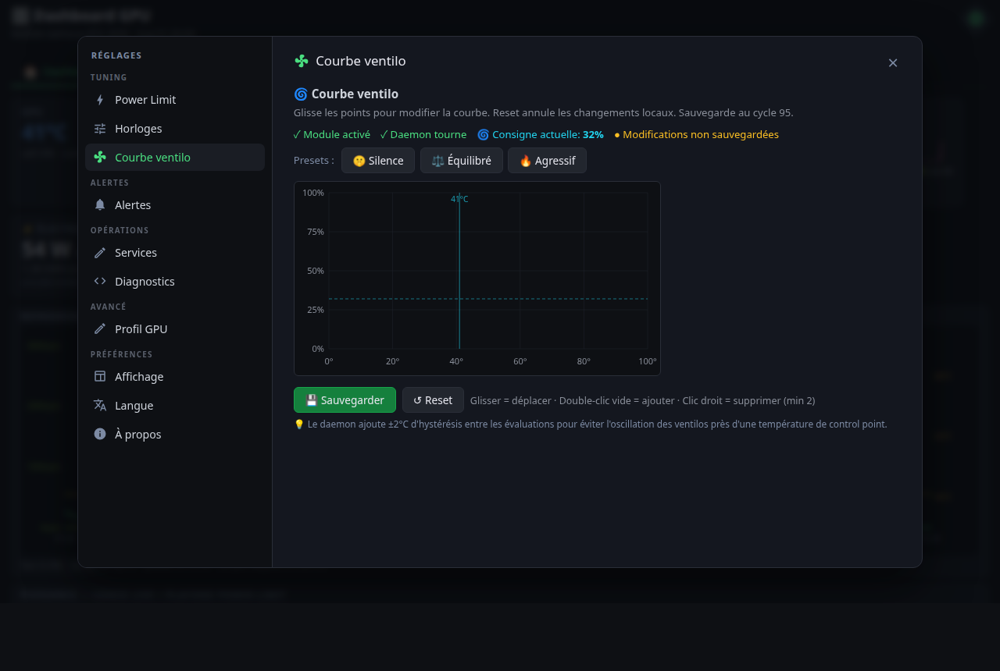<br/><sub><b>Fan curve</b> — drag/click/keyboard SVG editor + 3 presets (Silent/Balanced/Aggressive)</sub></td>
<td>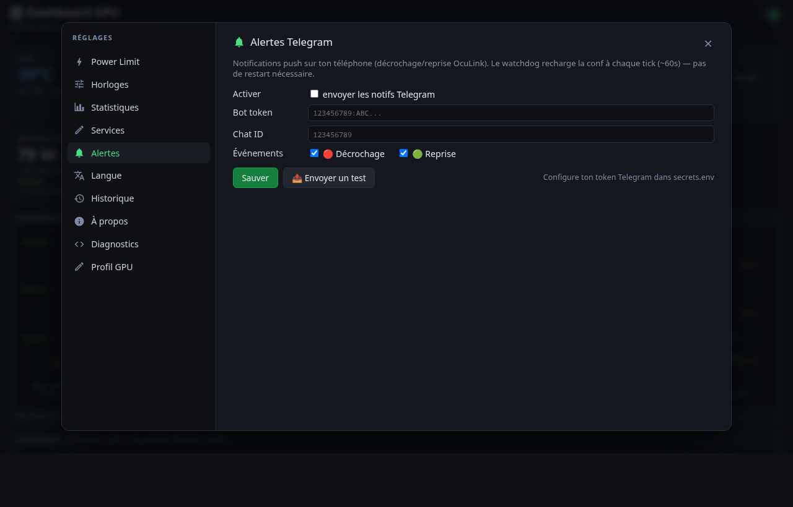<br/><sub><b>Alerts</b> — Telegram + webhook outbound + browser push + sound toggle</sub></td>
</tr>
<tr>
<td>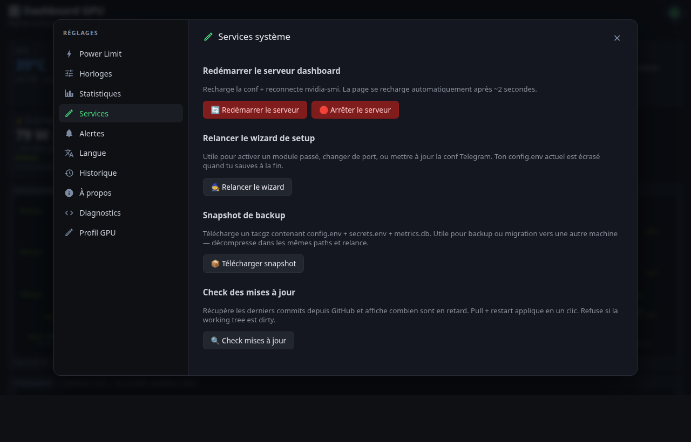<br/><sub><b>Services</b> — Restart · Stop · Redo wizard · Snapshot · git pull + restart</sub></td>
<td>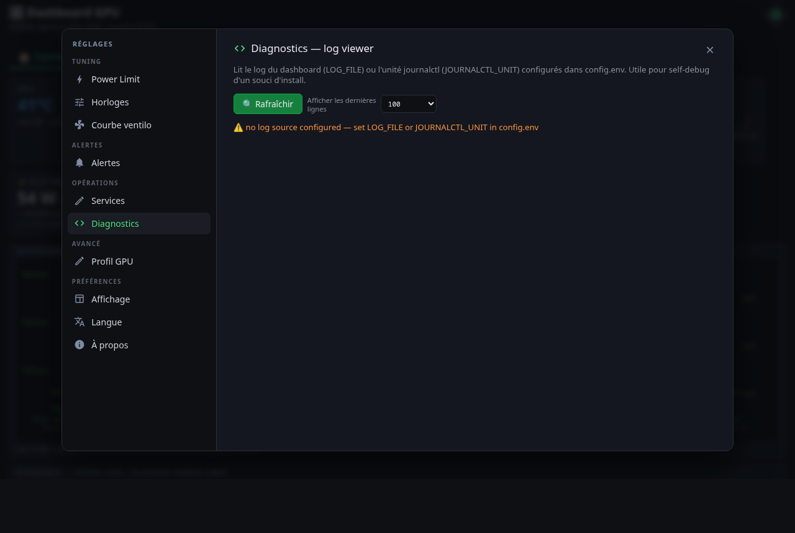<br/><sub><b>Diagnostics</b> — tail LOG_FILE or journalctl, support-friendly</sub></td>
</tr>
<tr>
<td>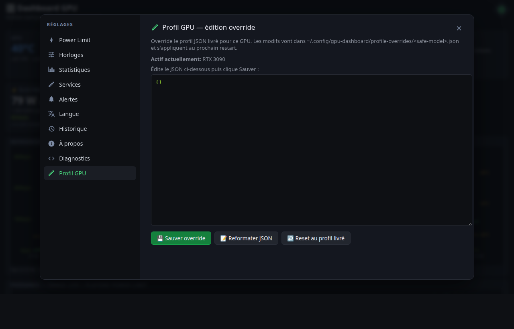<br/><sub><b>Profile</b> — JSON editor for the active GPU profile override</sub></td>
<td>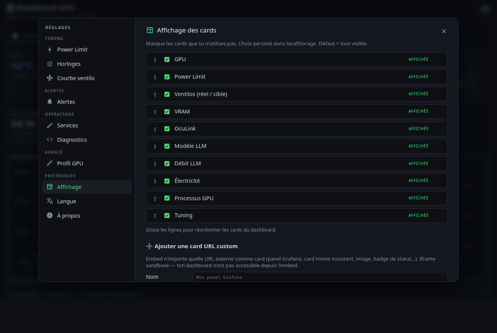<br/><sub><b>Layout</b> — hide/show cards · drag-reorder · custom URL embeds · 🎨 theme picker</sub></td>
</tr>
<tr>
<td>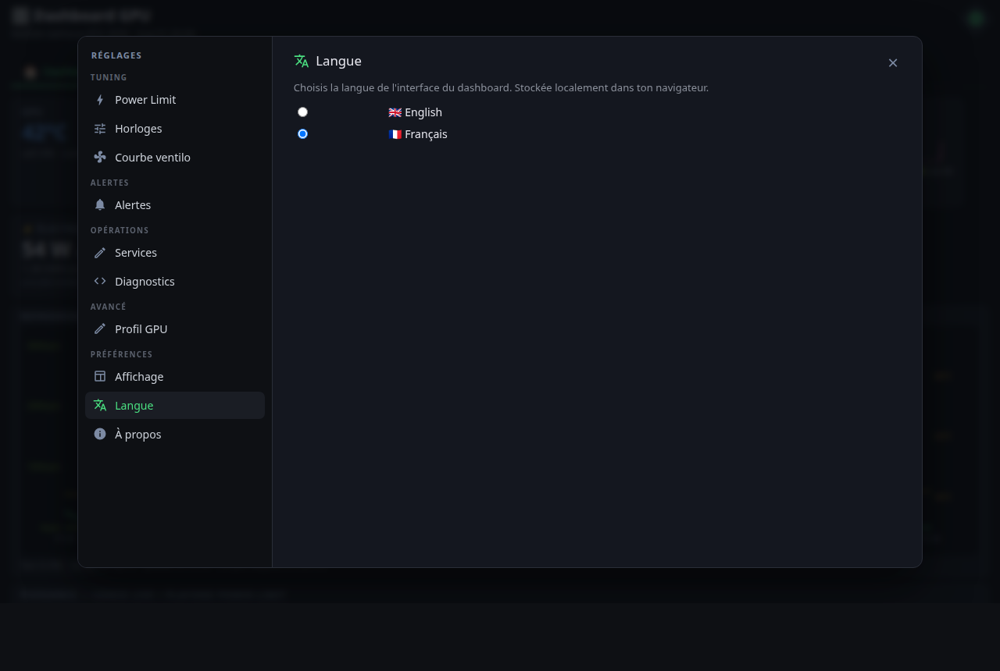<br/><sub><b>Language</b> — EN / FR full coverage</sub></td>
<td>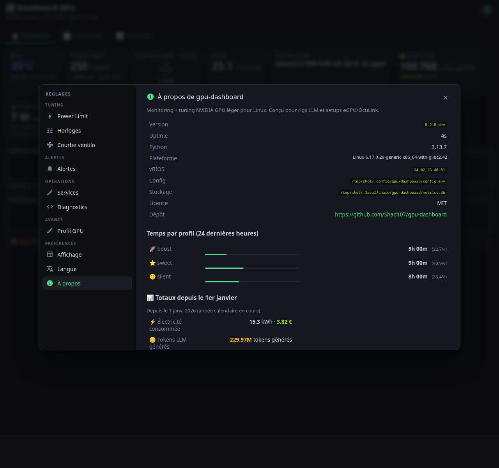<br/><sub><b>About</b> — version · vBIOS · profile time breakdown (24h)</sub></td>
</tr>
</table>

### 5-step web wizard on first launch

<table>
<tr>
<td width="50%"></td>
<td width="50%"></td>
</tr>
<tr>
<td width="50%"></td>
<td width="50%"></td>
</tr>
</table>

## What it does

A small HTTP dashboard you point your browser at (`http://localhost:9999`).
Built specifically for **headless/SSH'd Linux boxes running LLMs** on consumer NVIDIA
cards — including marginal setups (eGPU over OcuLink/Thunderbolt).

### Live monitoring
- 🌡️ GPU temperature, fan RPMs, power draw, GPU/mem clocks, VRAM used
- 🔥 Memory junction (GDDR hotspot) temperature — *the actual undervolt limiter on RTX 3080/3090/4090*
- 🪙 **LLM throughput** — tokens/sec + **tokens/Watt** efficiency (queries your `llama-server /metrics`)
- ⚡ **Electricity cost** — kWh/day + €/month at your configured rate
- 📊 30-day history in local SQLite, exportable as CSV
- 💤 Idle detection (>30 min) → banner suggesting to stop the server + €/month saved
- 👀 Per-process VRAM tracker — see which model owns the memory

### Tuning & automation
- 🤫⭐🚀 **3 power profile presets** (Silent/Sweet/Boost) — one-click bundles of power-limit + offsets
- 🤖 **Auto-profile switch** — daemon detects idle/inference/training and switches the profile automatically
- 🎚️ Power-limit slider with live perf-% estimate from the card's `perf_curve`
- ⏱️ Clock-offset sliders with safe/moderate/aggressive/danger risk zones
- 🌀 **fan_curve** daemon — custom curve replacing the stock NVIDIA one

### Integrations & alerts
- 🔔 **Telegram bot** alerts (OcuLink drops, threshold breaches)
- 🪝 **Webhook outbound** (Discord, Slack, n8n, Home Assistant — auto-detects payload shape)
- 📈 **Prometheus exporter** at `/api/prom` (gauges + counter, plug into Grafana / VictoriaMetrics)
- 🔥 **Threshold alerts** — gpu_temp / mem_temp / fan_pct, 3-consecutive + 5-min cooldown
- 🛂 **OcuLink/eGPU watchdog** — uptime tracking, drop count, alerts on drops

### Setup & operations
- 🧙 **5-step web setup wizard** on first launch (no CLI gymnastics — copy-paste sudo commands with live recheck)
- 🔄 **Restart / Stop / Snapshot / Update buttons** in Settings → Services (no shell needed for ops)
- 🌐 **EN + FR i18n** with reactive language switcher
- 📦 **Snapshot export** — config + secrets + DB as a single tar.gz for backup or migration
- 🩺 **/api/health** — JSON status (gpu_alive, db_connected, sampler_running) for external monitoring
- 📜 **Diagnostics tab** with log tail viewer (file or journalctl backends)
- 🧰 **Profile override editor** — tune perf_curve / clocks / fans from the UI without forking the repo

### GPU profiles per card
Bundled : RTX 3090, 3090 Ti, 4090, 5090. Community contributes more via PR.
JSON Schema validation at startup catches typos & malformed contributions.

## Why?

Existing tools fall short:
- `nvtop` is great in a TTY but offers no control, no alerting
- GreenWithEnvy needs a GTK desktop session running on the NVIDIA itself
- `nvidia-smi -pl` lives in a terminal, no history, no slider
- Nothing tracks OcuLink eGPU link drops with phone alerts

This tries to be the missing middle: **web UI, controllable, scriptable, alertable**.

## Hardware support

| GPU | Profile | Status |
|---|---|---|
| RTX 3090 | `rtx-3090.json` | ✅ Calibrated on real hardware |
| RTX 3090 Ti | `rtx-3090-ti.json` | ⚠ Estimated perf curve |
| RTX 4090 | `rtx-4090.json` | ⚠ Estimated perf curve |
| RTX 5090 | `rtx-5090.json` | ⚠ Based on published benchmarks |
| Others (NVIDIA) | `_generic.json` (fallback) | Conservative limits |

> Got a card not in the list? See [`profiles/SCHEMA.md`](profiles/SCHEMA.md) and open a PR.

## Install — 30 seconds, web wizard

Requires Linux + NVIDIA driver + Python 3.9+.
Tested on Ubuntu 24.04 / 25.10, Fedora 40, Arch.

### Option A — one-liner bootstrap + web wizard (recommended)

```bash
curl -fsSL https://raw.githubusercontent.com/Shad107/gpu-dashboard/main/scripts/get.sh | bash
```

The script does **only** these things (no sudo, no auto-install of system packages):

1. Clones the repo to `~/gpu-dashboard`
2. `pip install --user jsonschema` (the only Python dep)
3. Starts the dashboard in the background on port 9999
4. Prints the URL to open in your browser

Open the URL, a **5-step wizard** walks you through:
- Detected hardware (GPU, OS, profile match)
- Which optional modules to enable
- For each module needing root, the **exact sudo command to copy-paste in a terminal** (the wizard re-checks it after you run it)
- Final config (port, default power-limit)
- Done — restart the dashboard to apply

> **Want to audit the script first?** It's 116 lines, viewable at [`scripts/get.sh`](scripts/get.sh).
> Don't trust `curl | bash`? Use Option B below.

### Option B — manual clone (full audit)

```bash
git clone https://github.com/Shad107/gpu-dashboard.git
cd gpu-dashboard
python3 -m pip install --user jsonschema
PYTHONPATH=src python3 -m gpu_dashboard
```

Open `http://localhost:9999` — the same web wizard runs.

### Option C — CLI install (headless / scripted)

For headless servers or automation, the legacy interactive CLI is still available:

```bash
git clone https://github.com/Shad107/gpu-dashboard.git
cd gpu-dashboard
./install.sh --detect-only    # show what would happen (no writes)
./install.sh                   # interactive prompts
PYTHONPATH=src python3 -m gpu_dashboard
```

### Sudo commands the wizard suggests

The wizard never runs sudo silently. For each module needing root, you'll see
**one** bash command pointing to an audit-friendly script in the repo:

| Module | Command suggested by wizard |
|---|---|
| `power_limit` | `sudo bash scripts/install-power-limit-wrapper.sh --user $USER` |
| `clock_offsets` | `sudo bash scripts/install-coolbits-xorg.sh` (`--headless` for VM/eGPU) |
| `oculink_watchdog` | `sudo bash scripts/install-oculink-watchdog.sh` |

Each script supports `--check` (verify if already installed) and `--print`
(show what it would write without writing) so you can audit before running.

## API endpoints

Pure stdlib HTTP server. JSON everywhere except `/api/export` (CSV) and `/api/snapshot` (tar.gz).

| Method | Path | Purpose |
|---|---|---|
| GET | `/api/state` | Live snapshot (cards, sampler buffer, processes, modules state) |
| GET | `/api/history?from=&to=&step=` | Historical samples from SQLite, resamplable |
| GET | `/api/events?from=&kind=` | OcuLink drops, alerts, manual changes |
| GET | `/api/export?since=` | Raw CSV download of samples |
| GET | `/api/processes` | Per-process VRAM via `nvidia-smi --query-compute-apps` |
| GET | `/api/prom` | Prometheus text exporter |
| GET | `/api/health` | JSON health for monitoring (200 OK / 503 degraded) |
| GET | `/api/about` | Version, paths, vBIOS, uptime |
| GET | `/api/electricity` | kWh + €/month at configured rate |
| GET | `/api/llm/stats` | tokens generated + tokens/Watt (from llama-server /metrics) |
| GET | `/api/fan-curve` | Current fan curve + target % |
| GET | `/api/auto-profile` | Auto-switch daemon status (current classification) |
| GET | `/api/power-profiles` | List Silent/Sweet/Boost configured |
| GET | `/api/setup/detect` | Wizard env detection |
| GET | `/api/setup/recheck/<module>` | Re-run a module's `can_enable()` |
| GET | `/api/logs?tail=N` | Tail dashboard log (file or journalctl) |
| GET | `/api/update/check` | `git fetch` + commits-behind count |
| GET | `/api/snapshot` | tar.gz of config + DB |
| POST | `/api/set-power-limit` | Apply watts via sudoers wrapper |
| POST | `/api/set-offsets` | Apply GPU/mem clock offsets |
| POST | `/api/power-profiles/apply/<name>` | One-click profile (Silent/Sweet/Boost) |
| POST | `/api/alerts-config` | Save Telegram config |
| POST | `/api/alerts-test` | Send a test Telegram |
| POST | `/api/electricity/config` | Update rate live (no restart) |
| POST | `/api/profile/save` | Persist a profile override |
| POST | `/api/setup/save` | Wizard saves config.env |
| POST | `/api/restart` | Re-exec the server in place |
| POST | `/api/stop` | Graceful sys.exit(0) |
| POST | `/api/update/pull` | `git pull --ff-only` (refuses dirty tree) |

## Optional modules

Each feature is opt-in via `MODULE_*=1` in `config.env`. The wizard only proposes
what your env supports.

| Module | Requirement | What it adds |
|---|---|---|
| **power_limit** | sudoers wrapper installed | UI slider + 3 profile presets, live perf-% estimate |
| **clock_offsets** | Coolbits ≥ 8 in xorg.conf | Sliders for GPU/mem clock offsets with risk zones |
| **telegram_alerts** | bot token + chat ID | Push notifications on events |
| **oculink_watchdog** | eGPU detected (PCIe x4 link) | Tracks link uptime, alerts on drops |
| **fan_curve** | Coolbits ≥ 4 + Xorg | Custom fan curve replacing the stock NVIDIA one |
| **auto_profile** | sampler running | Daemon classifies idle/inference/training, auto-switches profile |
| **alert_monitor** | TG or webhook configured | gpu_temp / mem_temp / fan_pct threshold alerts |
| **webhook** | a webhook URL configured | Discord / Slack / n8n / Home Assistant outbound |

## Integrations

**🎁 Ready-to-import Grafana dashboard** — see [`docs/grafana/yearly_dashboard.json`](docs/grafana/yearly_dashboard.json).
Imports as **Yearly overview** with 9 panels : year-to-date kWh + cost + tokens, latest-alert age,
live power + temp + fan, today's energy, OcuLink drops, GPU alive status.
Grafana → Dashboards → New → Import → paste JSON (or upload the file).

```bash
# Grafana / VictoriaMetrics — Prometheus scrape config
- job_name: gpu-dashboard
  static_configs: [{targets: ['localhost:9999']}]
  metrics_path: /api/prom

# Discord webhook
WEBHOOK_ENABLED=1
WEBHOOK_URL=https://discord.com/api/webhooks/.../...

# Home Assistant / n8n
WEBHOOK_URL=https://n8n.local/webhook/gpu-alert
# Payload: {"text", "kind", "source": "gpu-dashboard", "timestamp"}

# Uptime Kuma — HTTP keyword monitor
URL : http://localhost:9999/api/health
Keyword : "status":"ok"
```

## Architecture

```
gpu-dashboard/
├── src/gpu_dashboard/                # Python backend (stdlib + jsonschema)
│   ├── server.py                     # HTTP routes + daemon lifecycle
│   ├── api.py                        # 20+ JSON handlers (handle_state, handle_history…)
│   ├── storage.py                    # SQLite with WAL, thread-safe writes, schema versioning
│   ├── retention.py                  # Daemon: hourly purge + weekly VACUUM
│   ├── metrics.py                    # Sampler (5s interval, also writes to DB)
│   ├── config.py                     # Layered .env loader (defaults → file → env vars)
│   ├── profile.py                    # GPU profile load + match + JSON Schema validation
│   ├── detect.py                     # Env probing (OS, NVIDIA, Coolbits, OcuLink…)
│   ├── install.py                    # CLI installer logic (= scripts/install-*.sh in v0.3+)
│   └── modules/                      # Opt-in features (each via MODULE_*=1)
│       ├── power_limit.py            # Sudoers wrapper for nvidia-smi -pl
│       ├── clock_offsets.py          # nvidia-settings, no-sudo via Coolbits
│       ├── fan_curve.py              # Custom fan curve daemon
│       ├── auto_profile.py           # Auto idle/inference/training switching
│       ├── alert_monitor.py          # Threshold daemon + dedup
│       ├── telegram_alerts.py        # Telegram via urllib (no requests dep)
│       └── webhook.py                # Generic HTTP POST (Discord/Slack/n8n)
├── frontend/                         # Svelte 5 + Vite + TypeScript
│   └── src/                          # Top-nav (Dashboard/Stats/History) + 9-tab settings modal + live cards
├── profiles/                         # GPU JSON profiles + schema.json (Draft 2020-12)
├── scripts/                          # get.sh + 3 sudo install scripts (audit-friendly)
├── tests/                            # pytest, 400+ tests, no external services
└── .github/workflows/ci.yml          # pytest matrix 3.9→3.13 + pnpm build + scripts smoke
```

## Contributing

Profiles for new cards are **the highest-value contribution**. See
[`profiles/SCHEMA.md`](profiles/SCHEMA.md). Code contributions welcome too — see
[`CONTRIBUTING.md`](CONTRIBUTING.md).

## License

MIT. See [`LICENSE`](LICENSE).

## 🗺️ Roadmap

### ✅ Delivered (v0.3.0-dev — cycles 1-110)

**Live monitoring**
- 8 cards : GPU · Power Limit · Fans (RPM/target) · VRAM · OcuLink · Modèle LLM · Débit LLM (tokens + tok/W) · Électricité (€/month) · GPU processes
- Live tab title : `44°C · 250W · GPU Dashboard`
- Idle banner when GPU has been <5% util for 30 min (with calculated €/month savings)

**Stats & history**
- Top-level views : Dashboard · Stats · History (URL-hash bookmarkable)
- Stats sparklines : LLM perf · Power · Thermal · Profile time · Fan distribution · Heatmap
- History chart : 1h/6h/24h/7d/30d ranges × 6 metrics · compare-to-24h/7d/30d · Export CSV
- 24-hour heatmap : avg watts × hour-of-day, color-coded by €/h
- About tab : Year-to-date energy + tokens · 24h profile-time breakdown · recent profile switches

**Tuning**
- Power limit slider + 3 named presets (Silent/Sweet/Boost)
- Clock offsets (GPU/mem) with safe/moderate/aggressive zones
- **Fan curve editor** : drag-and-drop SVG + keyboard fine-tuning + 3 presets + persist to disk
- Auto-profile daemon : classifies load (silent/sweet/boost) and switches automatically

**Multi-GPU**
- Picker dropdown in header (shows when >1 NVIDIA GPU detected)
- Per-GPU samples, per-GPU API (`?gpu_index=N`), per-GPU UI

**Alerts & integrations**
- Telegram + webhook outbound (Discord/Slack/n8n/Home Assistant auto-detected)
- Browser push notifications (VAPID + service worker)
- Sound notification toggle
- Threshold alerts (GPU/mem temp, fan %, VRAM %) with cooldown + min-consecutive
- Latest-alert footer on dashboard + alerts list in Stats

**Customization**
- Layout : hide/show each card · drag-and-drop reorder · custom URL iframe cards
- Theme : dark (default) / light · 🎨 toggle in Layout tab · `?theme=light|dark` URL override
- i18n : English + French (full coverage)

**API & ecosystem**
- 30+ endpoints (state, history, stats, alerts, push, fan-curve, profile-stats, power-heatmap, llm/perf, llm/lifetime, electricity, version, export, export/year, …)
- Prometheus exporter `/api/prom` with year-to-date gauges (kWh, cost, tokens, alert age)
- Grafana ready-to-import dashboard : [`docs/grafana/yearly_dashboard.json`](docs/grafana/yearly_dashboard.json)
- Uptime Kuma compatible `/api/health` with `recent_alerts`
- CSV export with `/api/export?since=` and `/api/export/year`

**Quality**
- 530+ Python tests on Py 3.9-3.13 in CI (GitHub Actions matrix)
- Pure-stdlib backend (only `jsonschema` runtime dep) · openssl for VAPID + signing
- DB schema v4 with idempotent migrations
- Mobile responsive (768/600px breakpoints)

### 💡 Parked / future work

Niche items not currently planned but considered :
- **Per-fan RPM curves** : separate fan 0 / fan 1 curves (eGPU-specific use case)
- **RFC 8291 encrypted Web Push** : currently uses a fetch-on-push pivot (functional but the notification text comes from the SW fetching `/api/alerts/latest` rather than from the push payload)
- **AMD/Intel GPU backends** : Linux-only NVIDIA today ; v1.0 territory, needs a HAL abstraction
- **Coolbits auto-detection in wizard** : check `/etc/X11/xorg.conf.d/*.conf` for `Coolbits=28`
- **Cloud telemetry SaaS** : opt-in dashboard sharing across rigs (local-only for now per design)
- **Windows / macOS support** : Linux-only by design

### 🚫 Won't do

- Monetization / paid tier (it's an OSS project for personal rigs)
- Closed-source forks repackaging the OSS work (license is MIT, but please at least cite)

See [`docs/PLAN.md`](docs/PLAN.md) for the detailed cycle log and per-commit history.
