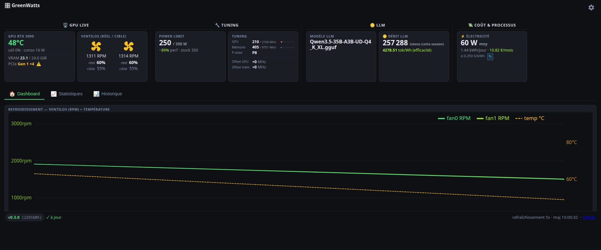
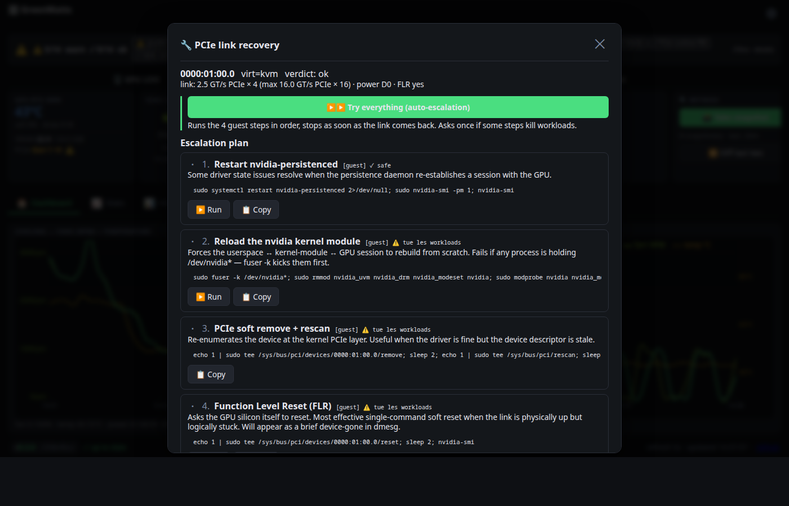
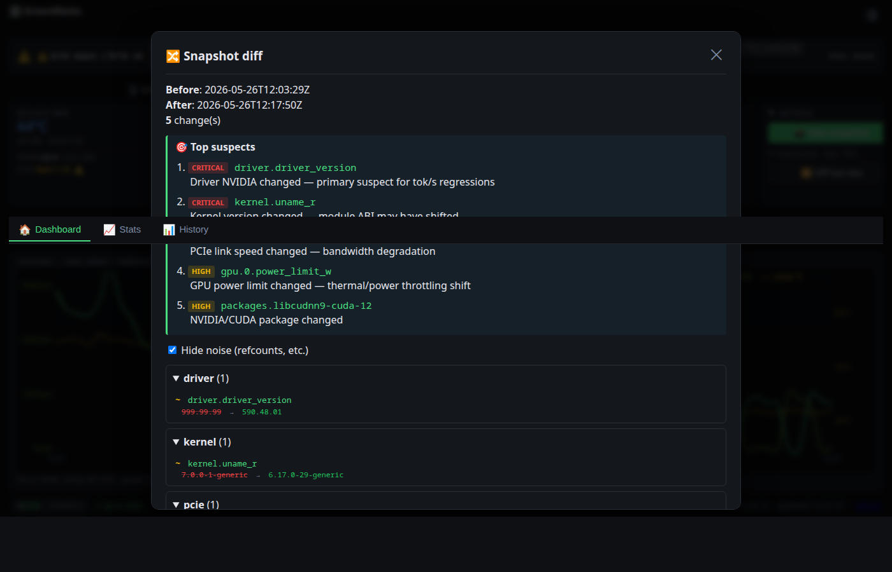
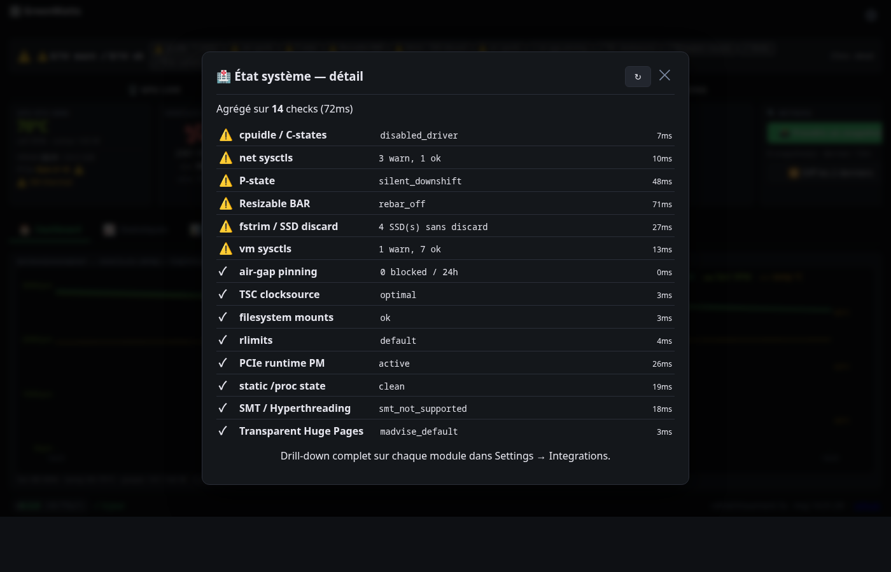
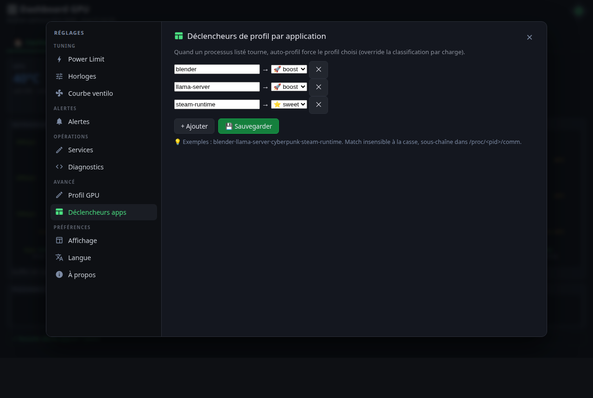

# gpu-dashboard

> Lightweight NVIDIA GPU monitoring + tuning dashboard for Linux.
> Built for **eGPU/OcuLink homelabs**, **LLM rigs**, and **monitoring nerds**.
> Pure Python stdlib + jsonschema. MIT.

🇬🇧 English · [🇫🇷 Français](README.fr.md)

[](https://github.com/Shad107/gpu-dashboard/actions/workflows/ci.yml)
[](LICENSE)




## Who it's for

| If you… | …the killer feature is |
|---|---|
| **🛂 Run an eGPU over OcuLink/Thunderbolt** and your link drops randomly | **PCIe Recovery Wizard** — bring the link back without rebooting Proxmox / your host |
| **🪙 Run LLMs locally** (llama.cpp / vLLM / Ollama / LM-Studio) | **tok/Wh tracking** + **Witness diff** to bisect a tok/s regression after an `apt upgrade` |
| **📈 Maintain monitoring stacks** (Grafana / Prometheus / Uptime Kuma / Home Assistant) | **`/api/prom` exporter** + ready-to-import Grafana dashboard + webhook outbound |
| **🔬 Tweak homelab systems** for max perf | **Health Strip** — 14 high-signal audits aggregated on the dashboard (ReBAR, THP, cpuidle, sysctls, …) |

---

## 🛂 For eGPU / OcuLink / Thunderbolt users

If you've ever lost your eGPU link mid-session and had to power-cycle the box, this is for you. The dashboard tracks link state continuously and ships an in-UI recovery flow.

### One-click PCIe link recovery — no reboot

When your OcuLink decrochs (link width drops to `0x3F`, AER fatal counter ticks, NVML loses the handle), open the wizard and walk the recovery ladder:

1. `persistence_restart` — bounce `nvidia-persistenced`
2. `module_reload` — unload + reload nvidia.ko (kills `/dev/nvidia*` consumers)
3. `pcie_rescan` — `echo 1 > /sys/bus/pci/.../rescan`
4. `flr` — Function Level Reset (if the device supports it)
5. If those don't restore the link → host-side `vfio-pci` rebind suggestion + Proxmox `qm restart` script

Each step shows the verdict afterwards (`link_recovered: true|false|none`) and stops as soon as the link is back. A "▶▶ Tout essayer" mode auto-escalates with a pre-warning before kills_workloads steps and an out-of-band tail command for when the browser tab freezes mid-recovery.



### Permanent OcuLink watchdog daemon

Background systemd unit polls the link every second, journals every DROP/UP with timestamps, and feeds two clocks on the dashboard card:

- **`held_for`** — duration of the current up streak
- **`dropped_since`** — duration since the most recent DROP (if currently down)

When the watchdog log goes stale (e.g. service died but link is actually fine), the card cross-checks NVML live and flips the displayed state with a `📡 via NVML live` sub-line, so you never stare at "LIEN PERDU 72h" while the GPU is healthy.

### Telegram alerts on every drop

Push notifications on drop and recovery with the elapsed-down duration, so you can act before the rig falls off the network.

### Why it matters for r/eGPU

Existing eGPU monitoring (GreenWithEnvy, `nvtop`) doesn't track link health at all. `dmesg` shows the AER fatal but you still need to know `which sysfs surface to write to` to revive the device — and that's per-box homework. This dashboard ships the canonical 4-step ladder + sudoers wrapper so it's `Click → ▶▶ Tout essayer` instead of 30 minutes of forum-archaeology.

---

## 🪙 For homelab LLM operators

If your single 3090/4090/5090 runs llama.cpp or vLLM and you measure tokens/sec religiously, the dashboard wraps the whole inference rig in a feedback loop.

### tokens/sec + tokens/Watt live

Queries your `llama-server /metrics`, plots tok/s next to power draw and exposes the **efficiency ratio (tok/Wh)** — the metric that actually matters when comparing power-limit profiles. No other OSS dashboard surfaces this.

### 🔍 State Witness — bisect tok/s regressions

Driver bump or kernel update tanked your inference speed? Click **"📸 Take snapshot"** before and after the upgrade, then **"🔀 Diff les 2 derniers"**.

The snapshot captures:
- driver + CUDA version (`/proc/driver/nvidia/version`)
- kernel `uname -r` + cmdline + loaded modules + nvidia/vfio/pcieport module params
- PCIe link speed/width + AER counters + power state
- per-GPU power limit / persistence / compute mode / UUID
- targeted apt/rpm packages (nvidia-*, libcuda*, libcudnn*, libnccl*, linux-image-*, qemu-*, libvirt*)
- systemd unit states (persistenced, fabricmanager, oculink-watchdog, …)

The diff is then **ranked** — driver version delta scores 100/100, kernel uname 90, PCIe link speed change 85, NVIDIA/CUDA package bump 70, etc. Refcount drift (workload noise) is filtered out. The Top 5 suspects panel surfaces the most likely culprits first.



Survey-validated: vLLM/llama.cpp/Ollama/ROCm threads in the last 12 months show 10+ high-severity "I bumped X and lost 80% of my throughput" cases where the user couldn't bisect. Witness exists for that.

### 🔭 Shadow Telemetry — wall meter vs nvidia-smi

`arXiv 2312.02741` showed `nvidia-smi` samples only ~25% of A100/H100 runtime — peaks are missed entirely. If you wire a **Shelly Plug/Pro** (HTTP RPC, no MQTT broker needed) and/or a **DS18B20** 1-wire thermistor in your case, the dashboard reconciles:

- `wall_draw_w` (Shelly) vs `Σ NVML power_w` → **non_gpu_w delta** (PSU losses + fans + mobo)
- `ambient_c` (DS18B20) vs GPU die temp → headroom analysis

The card shows `295W mur · GPU: 285W · ailleurs: 10W (+3.5%)` so you see when your "GPU at 250W" actually pulls 310W at the wall.

### Power tuning loop

- 🤫⭐🚀 **3 power profile presets** (Silent / Sweet / Boost) — one-click bundles of power-limit + clock offsets
- 🤖 **Auto-profile daemon** — detects idle / inference / training and switches the profile automatically
- 🎯 **Per-app triggers** — when `llama-server` runs → force Boost; when `steam-runtime` runs → force Sweet
- 🎚️ Live `perf%` estimate as you drag the power-limit slider (from each card's profile curve)
- 🌀 **Custom fan curve editor** — SVG drag-and-drop + keyboard fine-tuning + anti-oscillation hysteresis

---

## 🏥 Health Strip — 14 audits surfaced

A thin strip at the top of the dashboard runs 14 curated checks in parallel (~70ms total) and shows aggregated `err / warn / ok` counts. Click for the per-check breakdown.



Checks included (each calibrated for homelab LLM rigs):

| Check | What it catches |
|---|---|
| `pstate` | GPU stuck in P0/P8 when it shouldn't be |
| `rebar` | Resizable BAR off → BAR1 = 256 MiB legacy sliding-window |
| `thp` | Transparent Huge Pages disabled / always-aggressive (mmap'd GGUF wants `madvise`) |
| `cpuidle` | C-state driver disabled / shallow-only → idle power leak + latency hit |
| `smt` | SMT/Hyperthreading flipped (forced off costs LLM throughput) |
| `clocksource` | TSC unstable / falling back to `hpet` / `acpi_pm` |
| `vm_sysctl` | `vm.swappiness=60` actively swaps your mmap'd model weights |
| `net_sysctl` | `rmem_max=208KiB` caps each LAN streaming client |
| `pcie_rpm` | PCIe runtime PM blocked upstream → wake stalls |
| `limits` | `memlock` default 8MiB → can't pin your model in RAM |
| `fs_mount` | Model directory mounted without `noatime` |
| `trim` | SSDs without `discard` mount option (model cache dies faster) |
| `airgap` | Air-gap pin status (when enabled) |
| `proc_static` | Static `/proc` attrs drifted since baseline |

The full 400+ audit modules are still in **Settings → Integrations** for deeper drilldowns; the Strip surfaces the 14 most-actionable.

---

## 📈 Monitoring & integrations

```bash
# Prometheus / Grafana / VictoriaMetrics
- job_name: gpu-dashboard
  static_configs: [{targets: ['localhost:9999']}]
  metrics_path: /api/prom

# Discord webhook (auto-detected payload shape)
WEBHOOK_ENABLED=1
WEBHOOK_URL=https://discord.com/api/webhooks/.../...

# Home Assistant / n8n
WEBHOOK_URL=https://n8n.local/webhook/gpu-alert

# Uptime Kuma — HTTP keyword monitor
URL : http://localhost:9999/api/health
Keyword : "status":"ok"
```

**🎁 Ready-to-import Grafana dashboard** — [`docs/grafana/yearly_dashboard.json`](docs/grafana/yearly_dashboard.json). 9 panels: year-to-date kWh + cost + tokens, latest-alert age, live power + temp + fan, OcuLink drops.

API endpoints (selection):

| Method | Path | Purpose |
|---|---|---|
| GET | `/api/state` | Live snapshot — cards, sampler buffer, processes, modules |
| GET | `/api/history?from=&to=&step=` | Historical samples (SQLite, resamplable) |
| GET | `/api/events?from=&kind=` | OcuLink drops, alerts, manual changes |
| GET | `/api/health-strip` | F5.1 — 14 audits aggregated, parallel evaluation |
| GET | `/api/witness/list` · `/diff?before=A&after=B` | F2 — snapshots + ranked diff |
| POST | `/api/witness/take` | F2 — capture system state now |
| GET | `/api/shadow-telemetry` | F3 — Shelly + DS18B20 vs NVML reconciliation |
| GET | `/api/pcie-recovery/advisor` | F4 — diagnostic + ordered recovery plan |
| POST | `/api/pcie-recovery/run-step` | F4 — execute one whitelisted recovery step |
| GET · POST | `/api/install/list` · `/check` · `/run` | F6 — one-click sudo install for all wrappers |
| GET | `/api/prom` | Prometheus text exporter |
| GET | `/api/health` | JSON health (Uptime Kuma compatible) |

Full list: 30+ endpoints. Pure stdlib `http.server`, JSON everywhere except CSV exports.

---

## Install — 30 seconds, web wizard

Requires Linux + NVIDIA driver + Python 3.9+.
Tested on Ubuntu 24.04 / 25.10, Fedora 40, Arch.

### Option A — one-liner bootstrap + web wizard (recommended)

```bash
curl -fsSL https://raw.githubusercontent.com/Shad107/gpu-dashboard/main/scripts/get.sh | bash
```

The script does **only** these things (no sudo, no auto-install of system packages):
1. Clones the repo to `~/gpu-dashboard`
2. `pip install --user jsonschema` (the only Python dep)
3. Starts the dashboard in the background on port 9999
4. Prints the URL to open in your browser

Open the URL → **5-step web wizard**. For modules needing root, the wizard shows the exact sudo command **or** you can use the new **one-click installer** (F6) — type your sudo password in a modal, the wrapper installs without copy-paste.

> **Want to audit `get.sh` first?** It's 116 lines, viewable at [`scripts/get.sh`](scripts/get.sh).

### Option B — manual clone

```bash
git clone https://github.com/Shad107/gpu-dashboard.git
cd gpu-dashboard
python3 -m pip install --user jsonschema
PYTHONPATH=src python3 -m gpu_dashboard
```

### Sudoers wrappers — one-click install via the UI

| Wrapper | Installed via UI? | What it enables |
|---|:---:|---|
| `power_limit_wrapper` | ✓ | UI slider sets `nvidia-smi -pl` without sudo prompts |
| `oculink_watchdog` | ✓ | systemd daemon journaling link drops |
| `coolbits_xorg` | ✓ | Xorg `Coolbits=28` for clock offsets + fan curve |
| `pcie_recovery_wrapper` | ✓ | NOPASSWD-scoped wrapper for the recovery wizard |
| `witness_dpkg_hook` | ✓ | apt dpkg hook → Witness snapshot before/after every `apt upgrade` (auto-baseline for tok/s regression diffs) |

Each wrapper is whitelisted by id, BDF-validated against `vendor=0x10de`, and passes only one of `persistence_restart / module_reload / pcie_rescan / flr` — no shell injection surface.

---

## 🖥️🖥️ Multi-GPU + 🎨 themes + 🌐 i18n

- **Multi-GPU**: picker dropdown in header. All UI (cards, history, sparklines, electricity, LLM) switches to the selected GPU. Per-GPU API via `?gpu_index=N`.
- **Themes**: dark (default) + light. Toggle in Layout tab, or `?theme=light|dark` URL.
- **i18n**: full EN + FR coverage. Switcher in Settings.

<table>
<tr>
<td width="50%"><br/><sub><b>🌙 Dark</b> — default</sub></td>
<td width="50%"><br/><sub><b>☀️ Light</b> — daytime</sub></td>
</tr>
</table>

### Mobile responsive


---

## Hardware support

| GPU | Profile | Status |
|---|---|---|
| RTX 3090 | `rtx-3090.json` | ✅ Calibrated on real hardware |
| RTX 3090 Ti | `rtx-3090-ti.json` | ⚠ Estimated perf curve |
| RTX 4090 | `rtx-4090.json` | ⚠ Estimated perf curve |
| RTX 5090 | `rtx-5090.json` | ⚠ Based on published benchmarks |
| Others (NVIDIA) | `_generic.json` fallback | Conservative limits |

> Got a card not in the list? See [`profiles/SCHEMA.md`](profiles/SCHEMA.md) and open a PR.

eGPU enclosures tested:
- **F9G-BK7** (Aliexpress no-name OcuLink x4 dock) — real-life link-drop testbed
- Any **OcuLink x4** / **TB4** enclosure should work in theory (the recovery wizard reads sysfs directly; nothing is enclosure-vendor-specific)

---

## Settings — 11 tabs

Bookmarkable via `?modal=<tab>`.

<table>
<tr>
<td width="50%"><br/><sub><b>Power Limit</b></sub></td>
<td width="50%"><br/><sub><b>Clocks</b></sub></td>
</tr>
<tr>
<td><br/><sub><b>Fan curve</b></sub></td>
<td><br/><sub><b>Alerts</b></sub></td>
</tr>
<tr>
<td><br/><sub><b>Services</b></sub></td>
<td><br/><sub><b>Diagnostics</b></sub></td>
</tr>
<tr>
<td><br/><sub><b>Layout</b></sub></td>
<td><br/><sub><b>App triggers</b></sub></td>
</tr>
</table>

**Integrations** tab also holds the 400+ deep audit modules organized in 13 categories (GPU & driver, PCIe & bus, Memory & swap, Storage & FS, Network, Power & thermal, Security & LSM, Boot & firmware, IRQ & sched, Tracing & BPF, Containers, Input, Meta-diag).

---

## Architecture

```
gpu-dashboard/
├── src/gpu_dashboard/                # Python backend (stdlib + jsonschema)
│   ├── server.py                     # HTTP routes + daemon lifecycle
│   ├── api/                          # JSON handlers (state, history, witness, health, shadow, pcie-recovery, install, …)
│   ├── modules/                      # 400+ opt-in features (each via MODULE_*=1)
│   │   ├── state_witness.py          # F2 — snapshot + diff + ranker
│   │   ├── health_strip.py           # F5.1 — parallel audit aggregator
│   │   ├── shadow_telemetry.py       # F3 — Shelly + DS18B20 vs NVML
│   │   ├── pcie_recovery_advisor.py  # F4 — diagnose + plan recovery
│   │   ├── pcie_recovery_runner.py   # F4 — execute one whitelisted step
│   │   ├── installer.py              # F6 — generalized one-click sudo install
│   │   ├── _nvml.py                  # ctypes wrapper for libnvidia-ml.so (no nvidia-smi fork)
│   │   ├── power_limit.py · fan_curve.py · auto_profile.py · …
│   │   └── (400+ audit modules in 13 categories)
│   ├── storage.py                    # SQLite WAL, thread-safe, schema versioning
│   ├── metrics.py                    # Sampler (5s interval)
│   ├── config.py                     # Layered .env loader
│   └── profile.py                    # GPU profile load + JSON Schema validation
├── frontend/                         # Svelte 5 (runes) + Vite + TypeScript
├── profiles/                         # GPU JSON profiles + Draft 2020-12 schema
├── scripts/                          # get.sh + 4 sudoers install scripts
├── tests/                            # pytest, 530+ tests, no external services
└── .github/workflows/ci.yml          # pytest matrix 3.9→3.13 + pnpm build + scripts smoke
```

---

## Contributing

Profiles for new cards are **the highest-value contribution**. See [`profiles/SCHEMA.md`](profiles/SCHEMA.md). Code contributions welcome too — see [`CONTRIBUTING.md`](CONTRIBUTING.md).

eGPU enclosure compatibility reports also wanted — open an issue with your enclosure model + link-drop frequency + which recovery step works for you.

## License

MIT. See [`LICENSE`](LICENSE).

---

## 🗺️ Roadmap

### ✅ Recently shipped (F-series)
- **F1** NVML via ctypes (sub-ms vs 50-200ms `nvidia-smi` subprocess)
- **F2** State Witness — snapshot + ranked diff (cause-of-regression analyzer)
- **F2.3** Witness auto-snapshot on `apt` (dpkg Pre+Post-Invoke hook)
- **F3** Shadow telemetry — Shelly + DS18B20 vs NVML reconciliation
- **F4** PCIe Recovery Wizard — diagnostic advisor + 4 whitelisted recovery steps + Proxmox/KVM awareness
- **F5.1** Health Strip — 14 audits parallel-aggregated on main dashboard
- **F5.4** Pre-warning panel before kills_workloads recovery steps
- **F6** Generalized one-click sudo install for all wrappers (password-prompt modal)

### ✅ Foundational (v0.3 cycles 1-110)
- 8 live cards · Stats page · History chart · 24h heatmap
- Tuning: power limit slider · 3 presets · clock offsets · fan curve editor · auto-profile · app triggers
- Alerts: Telegram · webhook (Discord/Slack/n8n/HA) · browser push · sound · thresholds
- Multi-GPU · dark/light themes · EN/FR i18n · mobile responsive
- 30+ API endpoints · Prometheus exporter · Grafana dashboard · Uptime Kuma `/health`
- 530+ tests on Py 3.9-3.13 in CI

### 💡 Considered next
- Auto-snapshot Witness on dpkg trigger (snapshot before each `apt upgrade`)
- HealthStrip expansion to 30+ audits via dynamic discovery
- Per-fan RPM curves (eGPU-specific)
- Cloud telemetry SaaS opt-in (local-only by default)

### 🚫 Won't do
- Monetization / paid tier (MIT, personal-rig project)
- Windows / macOS support (Linux NVIDIA only by design)
- Closed-source forks repackaging the OSS work (license permits, please at least cite)

See [`docs/PLAN.md`](docs/PLAN.md) for detailed cycle log + per-commit history.
